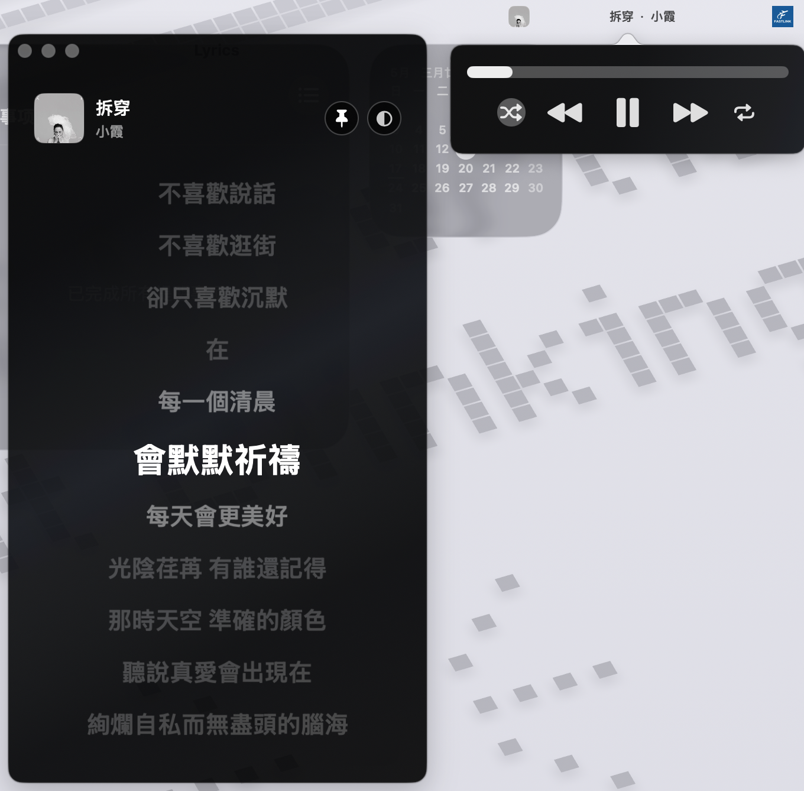

# MusicBar

Lightweight now-playing and synced lyrics for the macOS menu bar.

MusicBar is a full-featured macOS menu bar app for people who want quick access to the current song, cover art, playback controls, and a clean lyrics window without keeping Apple Music in the foreground.

MusicBar includes a 7-day free trial. After the trial, unlock the full version for $1.99 or RMB 3.99.

[](https://github.com/aronahhhh/MusicBar/releases/latest)



## Features

- Transparent menu bar status item with cover art, song name, and artist.
- Compact click menu with Settings and Quit actions.
- Hover playback controls from the menu bar.
- Resizable Apple Music style lyrics window with synced lyric highlighting.
- Playback controls for progress, play/pause, previous, next, shuffle, repeat, Mac output volume, output device selection, and lyric-line seeking.
- Auto lyrics window that appears while music is playing and hides when playback pauses.
- Lyrics window pinning, opacity control, custom lyric colors, custom background colors, and imported background images.
- Settings window with General, Lyrics, and About sections.
- Language selection for Simplified Chinese, Traditional Chinese, English, or the system language.
- Region-aware trial pricing: RMB 3.99 in mainland China, $1.99 elsewhere.
- Sparkle update integration with a GitHub Pages appcast template.
- Apple Music support.
- Lyrics matching through LRCLIB with NetEase fallback for more Chinese tracks.
- Responsive polling for low-latency menu bar and lyric updates.
- Minimal macOS app icon included in the bundle.

## Download

Download the latest trial DMG from GitHub Releases once a release is published.

If you are building locally:

```bash
scripts/build_app.sh
open dist/MusicBar.app
```

## Requirements

- macOS 13 Ventura or later.
- Apple Music installed.
- Apple Events permission when macOS asks for access to Music.

## Install

1. Download `MusicBar-vX.Y.Z.dmg` from the latest release.
2. Open the DMG and move `MusicBar.app` to `/Applications`.
3. Open it once from Finder.
4. When macOS asks, allow MusicBar to control Music.
5. If macOS blocks the unsigned trial build, open System Settings > Privacy & Security and approve it.

## Permissions and Privacy

MusicBar reads the current track, artist, album, playback state, artwork, position, and duration from Apple Music using AppleScript. Lyrics matching uses online lyric services and sends the current song title, artist, album, and duration to those services.

MusicBar does not collect analytics, does not create an account, and does not upload your library.

See [PRIVACY.md](PRIVACY.md) for more detail.

## Build an app bundle

```bash
scripts/build_app.sh
```

The bundle is created at:

```text
dist/MusicBar.app
```

## Run in development

```bash
swift run MusicBar
```

For the full menu bar app bundle, prefer `scripts/build_app.sh`.

## Extend to another player

Add a new `MusicProvider` implementation in `Sources/MusicBarApp/MusicProvider.swift`, then include it in the default provider list in `NowPlayingService`.

## Publishing to GitHub

Automatic updates use Sparkle 2 with GitHub Releases for DMG downloads and GitHub Pages for `docs/appcast.xml`.

One-time setup:

1. Generate a Sparkle EdDSA key pair with Sparkle's `generate_keys` tool.
2. Put the public key in `Info.plist` as `SUPublicEDKey`.
3. Add the private key as the GitHub repository secret `SPARKLE_PRIVATE_KEY`.
4. Enable GitHub Pages from the `main` branch `/docs` folder.

Release flow:

1. Update `CFBundleShortVersionString` and `CFBundleVersion` in `Info.plist`.
2. Commit the version bump.
3. Create and push a matching tag, for example `v0.2.1`.
4. GitHub Actions builds `MusicBar.app` with Sparkle, creates `MusicBar-vX.Y.Z.dmg`, signs it for Sparkle, creates the GitHub Release, and commits the updated `docs/appcast.xml`.

Local release checks:

```bash
REQUIRE_SPARKLE=1 scripts/build_app.sh
scripts/create_dmg.sh 0.2.1
scripts/update_appcast.sh 0.2.1 6 "https://github.com/aronahhhh/MusicBar/releases/download/v0.2.1/MusicBar-v0.2.1.dmg" 123456 "SIGNATURE"
```

## Known limitations

- Lyrics availability depends on third-party matching sources.
- The trial currently focuses on Apple Music.
- Trial builds are ad-hoc signed, not notarized, so macOS may show a first-launch security warning.

## Roadmap

- Better player support for more macOS music apps.
- Signed and notarized public builds.
- Signed and notarized public builds.
- Optional local `.lrc` lyric import.
- More menu bar display styles.
- Website or reseller-backed license activation.


## License

MIT. See [LICENSE](LICENSE).

## Contributing

Bug reports, lyrics matching examples, and player integration requests are welcome. See [CONTRIBUTING.md](CONTRIBUTING.md).
