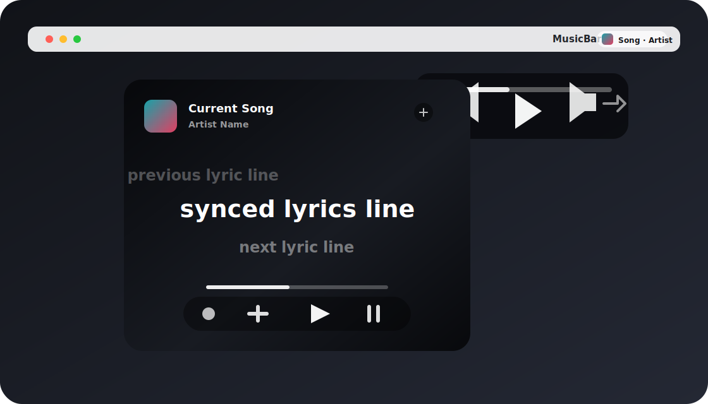

# MusicBar

Lightweight now-playing and synced lyrics for the macOS menu bar.

MusicBar is a free macOS menu bar app for people who want quick access to the current song, cover art, playback controls, and a clean lyrics window without keeping Apple Music in the foreground.

> Early preview: the app is usable, but player support and lyrics matching will keep improving through GitHub issues and releases.



## Features

- Transparent menu bar status item with cover art, song name, and artist.
- Compact click menu with Lyrics, Settings, Update, GitHub, and Quit actions.
- Hover playback controls from the menu bar.
- Resizable Apple Music style lyrics window with synced lyric highlighting.
- Playback controls for progress, play/pause, previous, next, shuffle, repeat, and lyric-line seeking.
- Optional auto lyrics window that appears while music is playing and hides when playback pauses.
- Optional launch-at-login support via a user LaunchAgent.
- Apple Music support.
- Lyrics matching through LRCLIB with NetEase fallback for more Chinese tracks.
- Responsive polling for low-latency menu bar and lyric updates.
- Minimal macOS app icon included in the bundle.

## Download

Download the latest free build from GitHub Releases once a release is published.

If you are building locally:

```bash
scripts/build_app.sh
open dist/MusicBar.app
```

## Requirements

- macOS 13 Ventura or later.
- Apple Music installed.
- Apple Events permission when macOS asks for access to Music.

## Install

1. Download `MusicBar.app` from the latest release.
2. Move it to `/Applications`.
3. Open it once from Finder.
4. When macOS asks, allow MusicBar to control Music.
5. If macOS blocks the unsigned preview build, open System Settings > Privacy & Security and approve it.

## Permissions and Privacy

MusicBar reads the current track, artist, album, playback state, artwork, position, and duration from Apple Music using AppleScript. Lyrics matching uses online lyric services and sends the current song title, artist, album, and duration to those services.

MusicBar does not collect analytics, does not create an account, and does not upload your library.

See [PRIVACY.md](PRIVACY.md) for more detail.

## Build an app bundle

```bash
scripts/build_app.sh
```

The bundle is created at:

```text
dist/MusicBar.app
```

## Run in development

```bash
swift run MusicBar
```

For the full menu bar app bundle, prefer `scripts/build_app.sh`.

## Extend to another player

Add a new `MusicProvider` implementation in `Sources/MusicBarApp/MusicProvider.swift`, then include it in the default provider list in `NowPlayingService`.

## Publishing to GitHub

Before publishing:

- Replace the preview image with real screenshots or a short demo GIF when available.
- Update the GitHub Homepage field from the menu bar Settings action.
- Create a GitHub Release with the built `MusicBar.app` zipped.
- Use the issue templates in `.github/ISSUE_TEMPLATE`.
- Keep release notes clear: added, fixed, known limitations.

The Update action opens the releases page for the configured GitHub repository URL.

## Known limitations

- Lyrics availability depends on third-party matching sources.
- The free version currently focuses on Apple Music.
- Preview builds are ad-hoc signed, not notarized.

## Roadmap

- Better player support for more macOS music apps.
- Signed and notarized public builds.
- Automatic update support.
- Optional local `.lrc` lyric import.
- More menu bar display styles.

## Issues 
- [x] 歌名和作者在菜单栏上显示框中居中
- [x] 切歌动画滑动方向换一个方向
- [x] 在歌词窗口滑动时不显示操作ui,希望达到的逻辑是如果鼠标在窗口滑动显示操作ui,静止一段时间后自动隐藏.
- [x] 悬停ui和歌词窗口操作ui中的随机播放和循环播放按钮没有按下反馈（不知道当前状态）
- [x] 歌词窗口可以暂停自动隐藏吗？

## License

MIT. See [LICENSE](LICENSE).

## Contributing

Bug reports, lyrics matching examples, and player integration requests are welcome. See [CONTRIBUTING.md](CONTRIBUTING.md).
